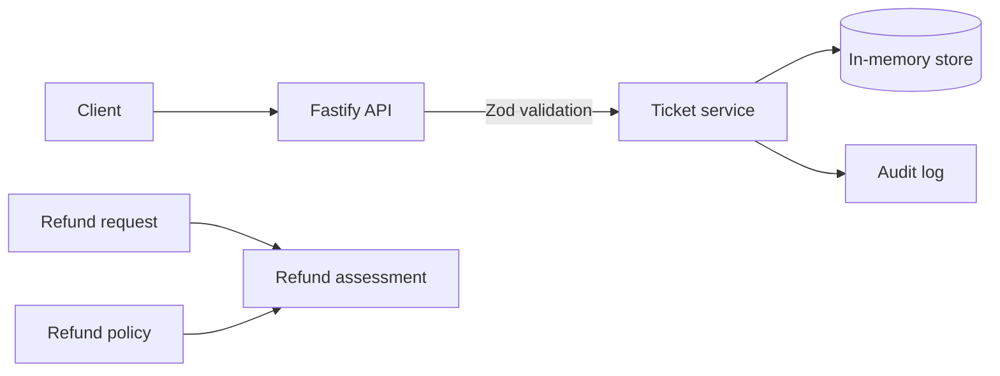

# AI Support Operations Platform

A local support workflow prototype for billing questions. It records customer tickets and checks refund requests against explicit policy rules before any action is taken.

Refund assessment is read-only. It never issues a refund or changes an invoice.

## What works now

- `GET /health` reports whether the API is running.
- `POST /api/tickets` validates a request, creates an open ticket for a seeded customer, and writes an audit entry.
- `GET /api/tickets` lists the queue; ticket detail includes the customer's invoices and matched policy phrases.
- `POST /api/tickets/:ticketId/refund-proposals` records a policy-checked proposal and requires an idempotency key.
- Refund assessment checks invoice ownership and state, remaining balance, policy window, amount limit, and customer tenure.
- Policy keyword search returns the matched phrases alongside each policy.
- The in-memory store starts with synthetic tickets, customers, invoices, and policies.



## Run locally

Requirements: Node.js 20 or newer and pnpm.

```sh
pnpm install
pnpm dev
```

The API listens on `127.0.0.1:3000` by default.

## Create a ticket

The demo store accepts these customer IDs: `cust_acme_corp`, `cust_solo_dev`, and `cust_suspicious_user`.

```sh
curl -X POST http://127.0.0.1:3000/api/tickets \
  -H "Content-Type: application/json" \
  -d '{"customerId":"cust_acme_corp","subject":"Duplicate charge","rawMessage":"I see two charges for this month."}'
```

The API returns `201` with the created ticket. Invalid bodies return `422`; unknown customer IDs return `404`.

## Propose a refund

```sh
curl -X POST http://127.0.0.1:3000/api/tickets/ticket_solo_duplicate_charge/refund-proposals \
  -H "Content-Type: application/json" \
  -H "Idempotency-Key: refund-proposal-solo-001" \
  -d '{"invoiceId":"inv_solo_001","policyId":"POL-REFUND-STANDARD","amountCents":2900}'
```

This case requires operator approval because the customer account is under 30 days old. Repeating the request with the same key returns the same proposal; using that key with different input returns `409`.

## Checks

```sh
pnpm test
pnpm typecheck
pnpm build
pnpm eval:retrieval
```

The current phrase-search baseline finds the expected policy in 5 of 6 synthetic scenarios at `k=3` (recall@3: 83.3%). The missed case is an invoice increase described without any configured keyword. This small fixture set is a baseline, not a production quality claim.

## Current limits

This is still a local prototype. Tickets, proposals, and audit entries disappear when the process stops. The API has no authentication, and proposals cannot be approved or executed yet. Do not use real customer data or expose this server to the internet.

There is no model provider, vector retrieval, approval screen, or frontend yet. The phrase-search baseline is intentionally simple; the missed scenario is kept in the evaluation set so later retrieval changes can be compared against it.
