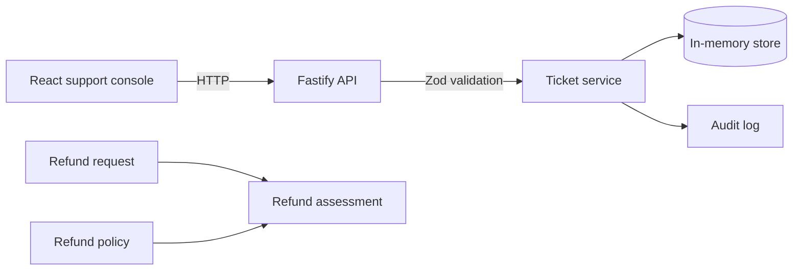

# AI Support Operations Platform

A local support workflow prototype for billing questions. It records customer tickets and checks refund requests against explicit policy rules before any action is taken.

Assessment decides eligibility. A separate execution step updates the synthetic invoice record; it does not move money through a payment provider.

## What works now

- `GET /health` reports whether the API is running.
- `POST /api/tickets` validates a request, creates an open ticket for a seeded customer, and writes an audit entry.
- `GET /api/tickets` lists the queue; ticket detail includes the customer's invoices and matched policy phrases.
- `POST /api/tickets/:ticketId/refund-proposals` records a policy-checked proposal and requires an idempotency key.
- `POST /api/refund-proposals/:proposalId/decision` records an operator approval or rejection.
- `POST /api/refund-proposals/:proposalId/execute` re-checks policy and updates the invoice record once.
- Refund assessment checks invoice ownership and state, remaining balance, policy window, amount limit, and customer tenure.
- Policy search returns the matched policy and any exact phrases found in the request.
- Optional AI triage uses retrieved policy and invoice evidence to draft a response for operator review.
- The in-memory store starts with synthetic tickets, customers, invoices, and policies.



## Run locally

Requirements: Node.js 20.19 or newer and pnpm.

Start the API in one terminal:

```sh
pnpm install
pnpm dev
```

Start the console in another terminal:

```sh
pnpm dev:web
```

Open `http://127.0.0.1:5173`. The API listens on `127.0.0.1:3000`; Vite proxies the console's API requests to it.

The console can search and filter the queue, inspect invoice and policy evidence, create refund proposals, record an operator decision, and execute approved or auto-eligible proposals. Execution only changes the synthetic in-memory invoice fixture. The operator ID entered for an approval is an audit label, not authentication.

## Policy retrieval

Keyword search is the default and works without an API key. To use semantic search, copy `.env.example` to `.env`, set `POLICY_RETRIEVAL_MODE=semantic`, and provide an OpenAI API key. The selected embedding model can be changed with `OPENAI_EMBEDDING_MODEL`.

Semantic mode embeds policy text once per server process and each ticket message when its details are requested. It combines cosine similarity with a small exact-keyword boost. Embeddings live in memory and are rebuilt after restart. Ticket messages and policy text are sent to OpenAI only in semantic mode; keep synthetic data in this prototype.

## Ticket triage

Triage is disabled by default. To enable it, set `AI_TRIAGE_MODE=openai` and provide `OPENAI_API_KEY`; `OPENAI_TRIAGE_MODEL` selects the model. `POST /api/tickets/:ticketId/triage` returns a short case summary, a reply draft, a suggested next step, and the evidence IDs used.

The agent has two read-only tools scoped to the selected ticket: policy search and that customer's invoices. Its output is schema-validated, evidence IDs are checked against tool results, and every response requires operator review. It cannot approve or execute refunds. When enabled, ticket text and the retrieved policy and invoice evidence are sent to OpenAI; use synthetic data here.

## Create a ticket

The demo store accepts these customer IDs: `cust_acme_corp`, `cust_solo_dev`, and `cust_suspicious_user`.

```sh
curl -X POST http://127.0.0.1:3000/api/tickets \
  -H "Content-Type: application/json" \
  -d '{"customerId":"cust_acme_corp","subject":"Duplicate charge","rawMessage":"I see two charges for this month."}'
```

The API returns `201` with the created ticket. Invalid bodies return `422`; unknown customer IDs return `404`.

## Propose a refund

```sh
curl -X POST http://127.0.0.1:3000/api/tickets/ticket_solo_duplicate_charge/refund-proposals \
  -H "Content-Type: application/json" \
  -H "Idempotency-Key: refund-proposal-solo-001" \
  -d '{"invoiceId":"inv_solo_001","policyId":"POL-REFUND-STANDARD","amountCents":2900}'
```

This case requires operator approval because the customer account is under 30 days old. Repeating the request with the same key returns the same proposal; using that key with different input returns `409`.

The decision endpoint takes `{"decision":"APPROVE","operatorId":"operator-17"}` (or `REJECT`) and its own idempotency key. It changes proposal and ticket state, but does not issue a refund.

Execution uses another idempotency key. It only runs for auto-eligible proposals or proposals already approved by an operator. The refund is recorded against the synthetic invoice fixture.

## Checks

```sh
pnpm test
pnpm typecheck
pnpm build
pnpm build:web
pnpm eval:retrieval
```

`pnpm eval:retrieval` runs the six synthetic scenarios using the configured retrieval mode. The phrase-search baseline finds the expected policy in 5 of 6 scenarios at `k=3` (recall@3: 83.3%). This small fixture set is a baseline, not a production quality claim.

## Current limits

This is still a local prototype. Tickets, proposals, invoices, and audit entries disappear when the process stops. The API has no authentication; `operatorId` is only a caller-supplied label. There is no payment provider integration. Do not use real customer data or expose this server to the internet.

The console runs through Vite and is not served by the Fastify production server. The AI triage endpoint is optional and disabled by default. There is no durable database or vector store, streaming response, or authentication. The phrase-search baseline is intentionally simple; the missed scenario is kept in the evaluation set so later retrieval changes can be compared against it.
