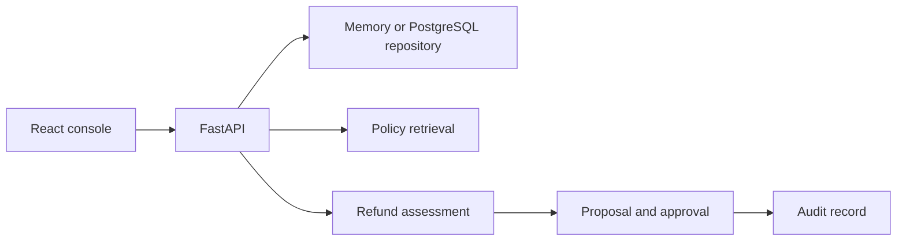

# AI Support Operations Platform

A support case workflow built with FastAPI, PostgreSQL, and a React console. It brings ticket context, policy evidence, refund review, and an optional AI drafted response into one operator workflow.

Refund execution updates a synthetic invoice record. The project does not connect to a payment processor or move money.

## Run it

The local workflow does not need an API key. Docker Compose starts PostgreSQL, applies the migrations, and serves the console and API:

```sh
docker compose up --build
```

Open [http://127.0.0.1:4173](http://127.0.0.1:4173). The API is also available at [http://127.0.0.1:3000](http://127.0.0.1:3000); its health route is `/health`.

For local development, install Python 3.13, uv, Node.js 24, and pnpm 11.7. Then run:

```sh
uv sync --all-groups
pnpm install --frozen-lockfile
```

Start the API and console in separate terminals:

```sh
pnpm dev
```

```sh
pnpm dev:web
```

The API uses seeded in-memory data by default. The Vite console runs at [http://127.0.0.1:5173](http://127.0.0.1:5173) and proxies API calls to port 3000.

## Case workflow



- Ticket, invoice, customer, and policy context stays together in the case view.
- Refund proposals check invoice ownership and state, remaining balance, policy window, amount limit, and customer tenure.
- Proposals require an idempotency key. Repeating a request returns its saved result; reusing a key with different input is rejected.
- Supervisor approval and refund recording are separate actions. Both are idempotent and audited.
- Optional session authentication distinguishes agents from supervisors. Login attempts are limited and stored as keyed hashes.
- `X-Request-ID` and request duration are returned and logged for each API request.

## PostgreSQL

Memory storage is useful while changing the API. PostgreSQL persists tickets, refund proposals, decisions, invoice updates, audit records, operator sessions, login limits, policy vectors, and AI workflow checkpoints.

To run only the database for local development:

```sh
docker compose up -d postgres
```

Copy `.env.example` to `.env`, set `STORAGE_MODE=postgres`, and use the local connection string already shown there. Then apply migrations and start the API:

```sh
pnpm db:migrate
pnpm dev
```

The migration runner records file checksums and refuses to run if an applied migration has changed.

## Authentication

Authentication is off in local development. Generate credentials with:

```sh
pnpm auth:config
```

Copy the printed `SESSION_SECRET` and `SUPPORT_OPERATOR_TOKENS` values to `.env`, then set `AUTH_MODE=session`. Agents can review cases and create proposals. Supervisors can also approve, reject, and record refunds. Session cookies are HTTP-only, same-site, and eight hours long; production cookies also require HTTPS.

Production settings require PostgreSQL and session authentication. Compose uses the local-only `support` database password unless `POSTGRES_PASSWORD` is set; keep the default bound to loopback and never expose it to a public network.

## Policy retrieval and triage

Keyword policy search works without external services. Run its small, keyless fixture evaluation with:

```sh
pnpm eval:retrieval
```

Semantic search is optional. Set `POLICY_RETRIEVAL_MODE=semantic` and `OPENAI_API_KEY`; policy embeddings are keyed by source hash and model and stored in PostgreSQL when PostgreSQL storage is enabled. The search combines cosine similarity with an exact phrase match boost.

AI triage is also optional and disabled by default. Set `AI_TRIAGE_MODE=openai` and `OPENAI_API_KEY` to enable it. The React console consumes progress events from the streaming endpoint. LangGraph loads the case, retrieves policy and invoice evidence, drafts a response, then validates the schema and every cited ID. The result always requires operator review. It cannot approve or record a refund.

Ticket text and selected evidence are sent to the configured model when semantic search or AI triage is enabled. The response is requested with provider storage disabled. Successful LangGraph runs delete their checkpoint; incomplete runs retain the minimum retry state until a retry completes. Use non-sensitive data with external providers.

The MCP server exposes three read-only tools over stdio: list cases, read one case with evidence, and search policies. It has no approval or refund execution tool. Start it with `pnpm mcp`; configure the command in an MCP host to use the repository directory and `uv run python -m backend.app.mcp_server`.

See [the security notes](docs/security.md) for data boundaries, model inputs, and deployment requirements.

## API surface

| Method | Path | Purpose |
| --- | --- | --- |
| `GET` | `/health` | API and repository health |
| `GET` | `/api/session` | Current operator and enabled features |
| `POST` | `/api/session/login` | Start an operator session |
| `POST` | `/api/session/logout` | Revoke the current session |
| `GET` | `/api/tickets` | List the case queue |
| `GET` | `/api/tickets/{ticketId}` | Load case, invoice, proposal, and policy context |
| `POST` | `/api/tickets/{ticketId}/triage/stream` | Stream optional triage progress and result |
| `POST` | `/api/tickets/{ticketId}/refund-proposals` | Assess and save a refund proposal |
| `POST` | `/api/refund-proposals/{proposalId}/decision` | Record a supervisor decision |
| `POST` | `/api/refund-proposals/{proposalId}/execute` | Record an approved refund against its invoice |

## Development checks

```sh
uv run pytest
uv run ruff check backend
pnpm build:web
```

PostgreSQL integration checks run when `TEST_DATABASE_URL` is set. GitHub Actions starts a disposable PostgreSQL service with pgvector, runs the Python checks and console build, and builds the Compose images.

## Scope

Seed records are fabricated and use reserved or example email domains. The invoice changes are database records only; no card, bank, billing, or payment-provider API is configured. Authentication is disabled by default for local use, so use the production requirements and HTTPS before any real deployment. External identity management and a live payment integration are outside this project.
